# ChIP-seq-analysis-and-visualization-using-Galaxy
This is a ChIP-seq analysis workflow in Galaxy using a [dataset](https://www.ncbi.nlm.nih.gov/Traces/study/?acc=PRJNA886671&o=acc_s%3Aa) on tissues taken from E18.5 mouse embryo from [Zhang et al.'s study](https://www.nature.com/articles/s41467-024-49684-1) on the impact of a specific mutation in the CTCF protein, where arginine at position 567 is replaced with tryptophan (R567W). This mutation has been linked to human developmental disorders in the brain, heart, and lungs. 

ChIP-seq was performed on brain, heart, and lung tissues in CTCF+/+ and CTCF/R567W mice in order to assess the alterations in chromatin binding affinity of the CTCF R567W-mutant protein in vivo. 

For this analysis, we are only using the lung tissue data. Most of the settings used in this analysis is matched to the method described in the paper. 

## Table of contents

- [Step 1: Import data](#step-1-import-data)
- [Step 2: Quality control using FastQC](#step-2-quality-control-using-fastqc)
- [Step 3: Trim using Trimmomatic ](#step-3-trim-using-trimmomatic)
- [Step 4: Map reads to mouse(mm10) genome using Bowtie2](#step-4-map-reads-to-mouse(mm10)-genome-using-bowtie2)
- [Step 5: Filter alignment based on quality using Samtools view ](#step-5-filter-alignment-based-on-quality-using-samtools-view)
- [Step 6: Find peaks using MACS2 callpeak](#step-6-find-peaks-using-macs2-callpeak)
- [Step 7: Map peaks to known genomic features using ChIPseeker](#step-7-map-peaks-to-known-genomic-features-using-chipseeker)
- [Step 8: Visualize the peaks using IGV](#step-8-visualize-peaks-using-IGV)
- [Step 9: Get the profile of the peaks](#step-9-get-profile-of-the-peaks)
- [Step 10: Peak visualization using IGV](#step-10-peak-visualization-using-IGV)
- [Step 11: Motif analysis using memeChIP](#step-11-motif-analysis-using-memeChIP)
- [Step 12: Gene Ontology](#step-12-gene-ontology)


## workflow
### Step 1: Import data 
The corresponsindg SRR numbers for the input and IP of the Wildtype and CTCF homozygous mutation for lung tissues are:

CTCF homozygous mutation
- Input → SRR21787371
- IP → SRR21787377 

Wildtype
- Input → SRR21787372
- IP → SRR21787378 

From [this website](https://www.ncbi.nlm.nih.gov/Traces/study/?acc=PRJNA886671&o=acc_s%3Aa), click on the boxes next to the SRR numbers for the Input and IP data for CTCF homozygous mutation (9 and 15 on the list) and then press the the galaxy button shown in the picture below. Do the same for the Input and IP data for Wildtype (10 and 16 on the list) 

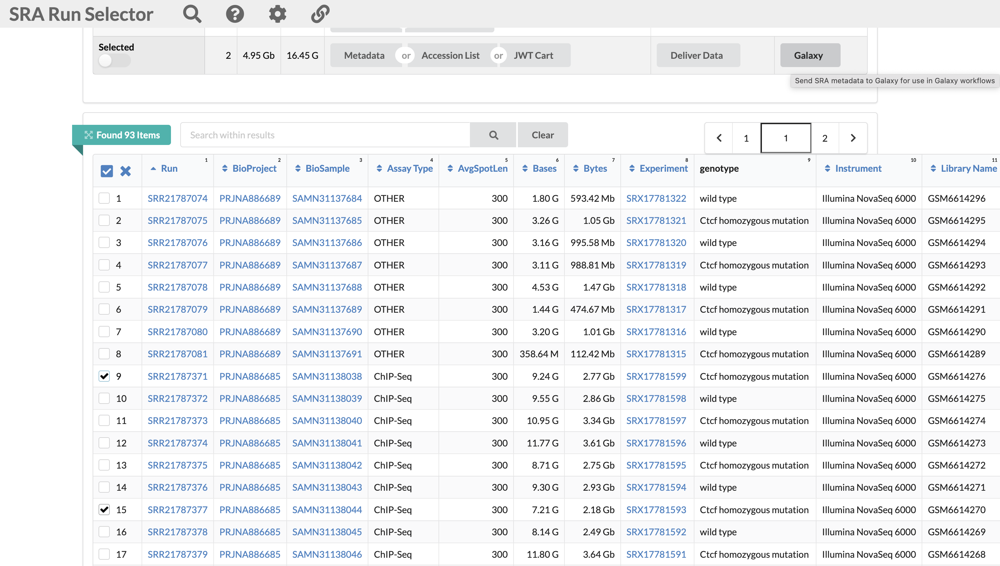

This will bring you directly to the galaxy website (Note that you will need to make a Galaxy account in order to get enough storage to do this analysis). 

Rename the first SRA (which was the CTCF homozygous mutation dataset) into *ctcf mutant SRA* and rename the second SRA (which was the wildtype dataset) into *wt SRA* by pressing the pencil icon in each box. 

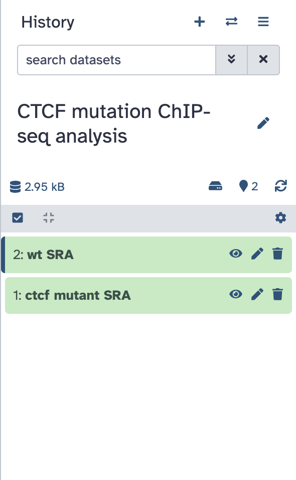

Go to ```tools``` → ```Get Data``` → ```Download and Extract Reads in FASTQ format from NCBI SRA```

Use the following settings:
* ```select input type```: list of SRA accession, one per line
* Under ```sra accession list```, input your SRA collection (i.e. *ctcf mutant SRA*/ *wt SRA*)
* ```select output format```: gzip compressed fastqc
Then press ```Run Tool```. Run it twice, once for each SRA collection in your history

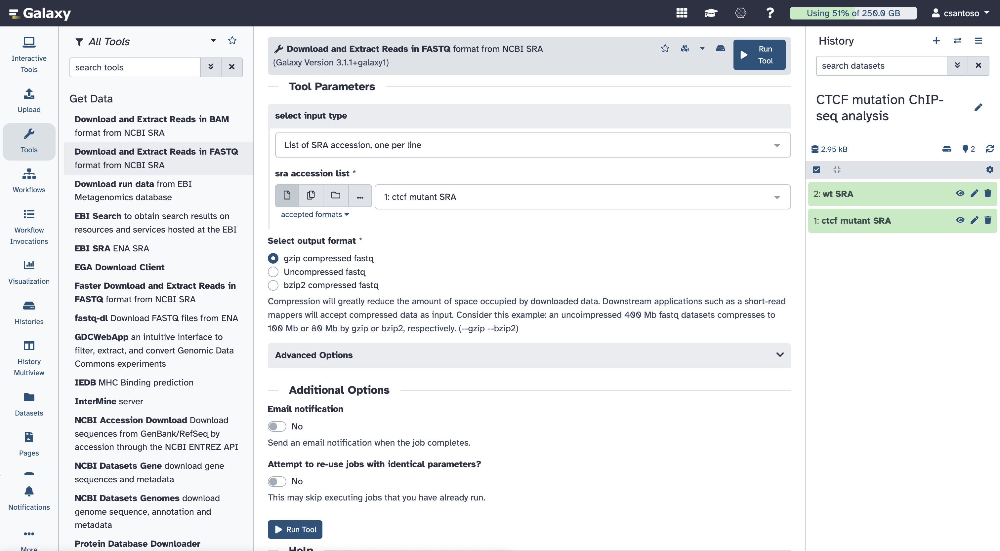

After it has finished running, you should see *a list with 2 fastqsanger.gz pairs* under each *Paired-end data (fastq-dump)* and *a list with 0 datasets* under each *Single-end data (fastq-dump)*. 

Rename the *Paired-end data (fastq-dump)* associated with *ctcf mutant SRA* into *Paired-end data (ctcf mutant)* and the *Paired-end data (fastq-dump)* associated with *wt SRA* into *Paired-end data (wt)*. If you ever forget which one is associated with which dataset, you can press the *Paired-end data (fastq-dump)* box and it will show the SRR numbers. 

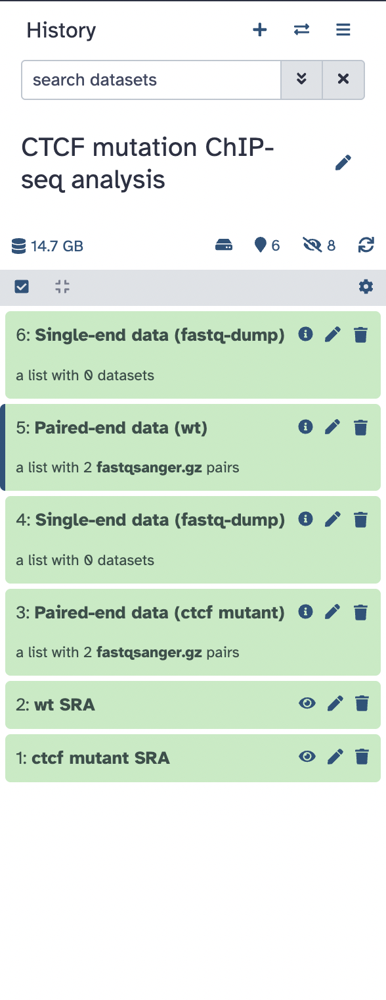

### Step 2: Quality control using ```FastQC``` 

Before we start aligning or analyzing the data, we need to assess and clean the data. ```FastQC``` performs a series of quality checks on your raw reads and provides an interactive HTML report with various diagnostic plots and summary statistics.  We will maingly use ```FastQC``` to decide whether we need to trim low-quality bases or adapter sequences. 

Run ```FastQC``` twice: Once with the *Paired-end data (wt)* as the input and once with *Paired-end data (ctcf mutant)* as the input 

Under ```Raw read data from your current history```, select the third icon (i.e. dataset collection) and choose *Paired-end data (wt)*/*Paired-end data (ctcf mutant)*. Then press run tool. 

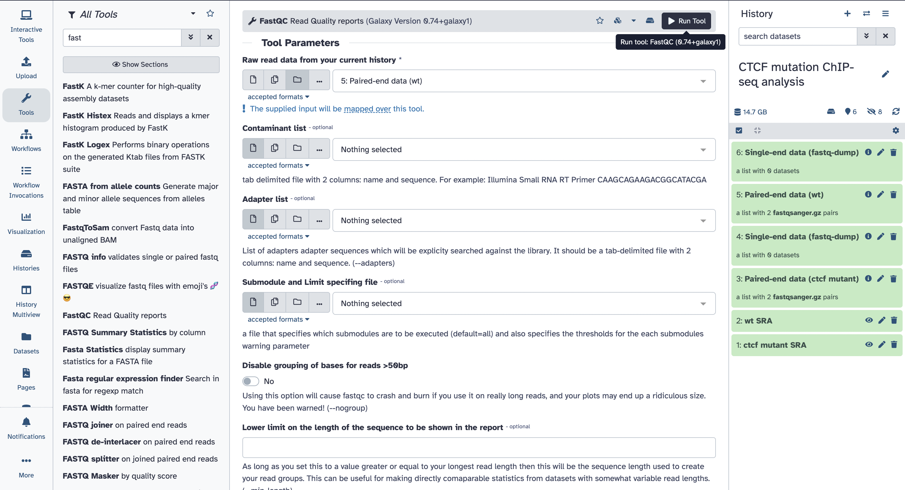

FastQC will have 2 outputs: *Webpage* and *Raw Data*. We will focus on the *Webpage* output. If you press on this output, you will see a report containing several plots. For a comprehensive explanation of all of the plots, check [this webstite](https://training.galaxyproject.org/training-material/topics/sequence-analysis/tutorials/quality-control/tutorial.html). The most important information for us is the *Overrepresented sequences* and *Adapter content*. Most of our dataset have a high percentage of *illumina Universal Adapter* and some data ( such as the one shown below) have a high percentage of PolyG sequence. Thus, we will trim out these 2 sequences. 

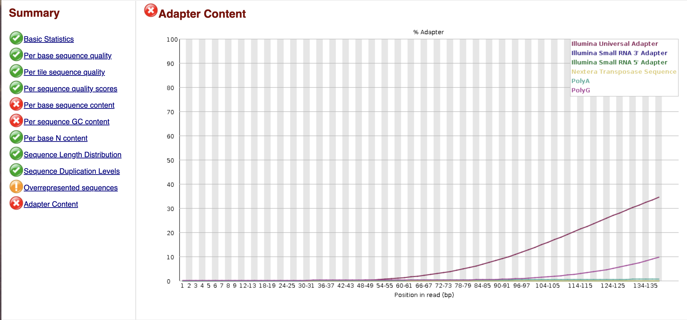


### Step 3: Trim using ```Trimmomatic``` 

```Trimmomatic``` is a tool used to trim and clean raw sequencing reads before downstream analysis like alignment or quantification.

Run ```Trimmomatic``` twice for each dataset (i.e. *Paired-end data (wt)*  and *Paired-end data (ctcf mutant)* : Once to trim out truSeq3(paired-end) and once to trim out polyG sequence

First trim (truSeq3(paired-end))
- input:
     - ```Single-end or paired-end reads?```: Paired-end (as collection)
     - Paired-end data (ctcf mutant) or Paired-end data (wt)
- Use the following settings:
     - ```Perform initial ILLUMINACLIP step?``` : Yes
          - ```Select standard adapter sequences or provide custom?```: standard
          - ```Adapter sequences to use```: truSeq3(paired-end)
     - ```Average quality required``` : 30
     - ```Quality score encoding```: phred 33
 
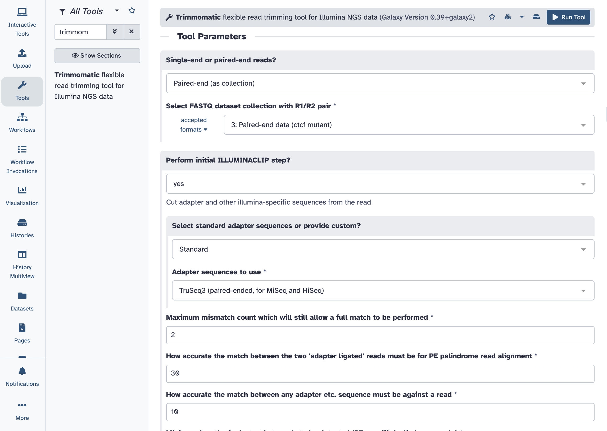

 
Second trim (PolyG) 
- input:
  - ```Single-end or paired-end reads?```: Paired-end (as collection)
  - the first trimmomatic run for each data collection
       - there are 2 outputs for trimmomatic: paired and unpaired. We will use the paired output as our dataset is paired-end. 
- Use the following settings:
     - ```Perform initial ILLUMINACLIP step?``` : Yes
          - ```Select standard adapter sequences or provide custom?```: custom
     - ```Adapter sequence```:
  ```
          > polyG
            GGGGGGGGGGGGGGGGGGGGGGGGGGGGGGGGGGGGGGGGGGGGGGGGGG
  ```
     - ```Average quality required``` : 30
     - ```Quality score encoding```: phred 33
 
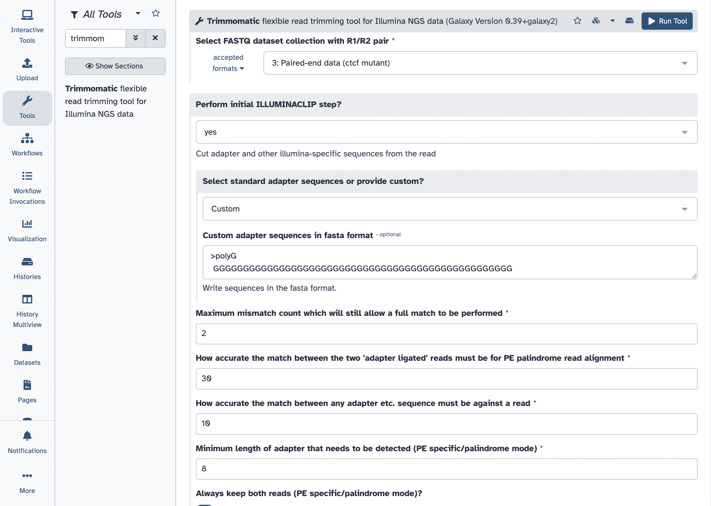

We will only be using the paired output of the 2nd trimmomatic run for each data collection so feel free to delete the first trimmomatic run after the 2nd one has finished running.  Name the outputs: *trimmomatic on wt* and *trimmomatic on ctcf mutant*


Then run fastQC on *trimmomatic on wt* and *trimmomatic on ctcf mutant* to see whether trimmomatic has succesfully trimmed out the adapter sequence and polyG sequence. Now in the fastQC report, we can see that we have trimmed out the adapter sequences. 

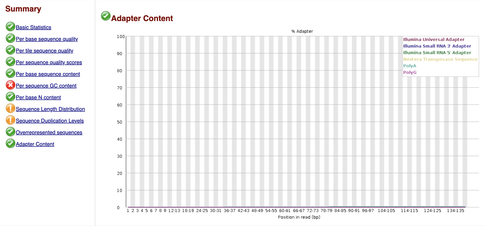


### Step 4: Mapping reads to mouse(mm10) genome using ```Bowtie2```

```Bowtie2``` is a tool used to align sequencing reads (typically from FASTQ files) to a reference genome. 

Run ```Bowtie2``` twice: Once with *trimmomatic on wt* as the input and once with *trimmomatic on ctcf mutant* as the input 

Use the following settings:
- ```Will you select a reference genome from your history or use a built-in index?```: Use a built-in genome index
     -```Select reference genome```: Mouse (mus musculus) : mm10
- ```Select analysis mode```
     -```Do you want to use presets?```: Very sensitive end-to-end

Name the outputs: *Bowtie2 on wt* and *Bowtie2 on ctcf mutant*

### Step 5: Filter alignment based on quality using ```Samtools view``` 

```samtools view``` is part of the SAMtools suite and is used to view, filter, and convert files between SAM and BAM formats. We are going to use it to filter the output of ```bowtie2``` to only include uniquely mapped reads with MAPQ > 30. 

Run ```Samtools view``` twice: Once on  *Bowtie2 on wt* and once on *Bowtie2 on ctcf mutant* 

Use the following settings:
- ```What would you like to look at?```:A filtered/subsampled section of reads
     - ```Configure filters```
       - ```Filter by quality``` : 30 //Only uniquely mapped reads with MAPQ > 30 were retained
      
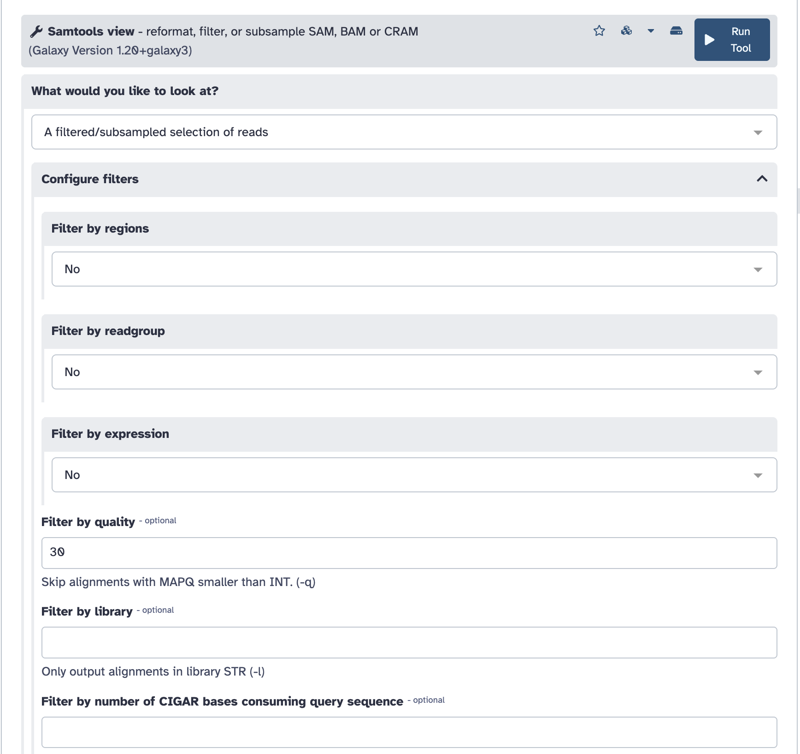


Name the outputs: *Samtools view on wt* and *Samtools view on ctcf mutant*

### Step 6: Find peaks using ```MACS2 callpeak``` 

```MACS2 callpeak``` is used to identify enriched regions of DNA — called "peaks" — from ChIP-seq data. It basically looks for places in the genome where there are many sequencing reads aligned to it which indicates where CTCF binds. 

First we will seperate our dataset collections into single datasets. Go to ```Extract Dataset```. 
- ```Input List``` : *Samtools view on wt*
     - ```How should a dataset be selected?```: Select by index
     -``` Element index```: 0 and 1 //Run once with element index as 0 and run once with element index as 1.

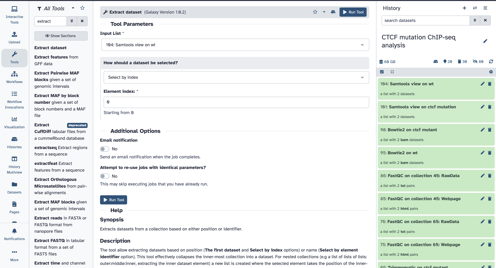

Do the same thing for *Samtools view on ctcf mutant*. This will basically seperate all of out single datasets. As a results, we will ahve all of the SRR numbers in our history. Rename the SRR numbers as follows:
- SRR21787371 → *ctcf mutant input*
- SRR21787377 → *ctcf mutant IP*
- SRR21787372 → *wt mutant input*
- SRR21787378 →  *wt mutant IP*

Run ```MACS2 callpeak``` twice: 
- Once on WT
    - ```ChIP-Seq Treatment File``` : *wt mutant IP*
    - ```Do you have a Control File?```: yes
         - ```ChIP-Seq Control File``` : *wt mutant input*
- Once on CTCF mutat
    - ```ChIP-Seq Treatment File``` : *ctcf mutant IP*
    - ```Do you have a Control File?```: yes
         - ```ChIP-Seq Control File``` : *ctcf mutant inpu*t 

Use the following settings:
- ```Format of Input Files``` : paired-end BAM
- ```Effective genome size``` : M.musculus (1.87e9)

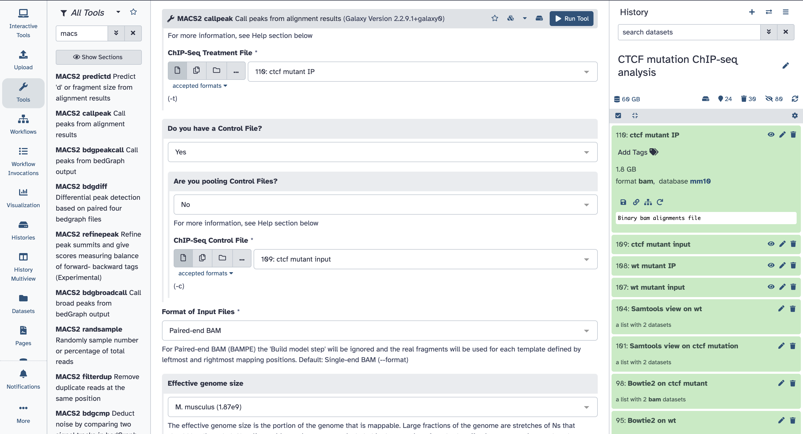

Name the output: *MACS2 callpeak on wt* and once on *MACS2 callpeak on ctcf mutant*

### Step 7: Map peaks to known genomic features using ```ChIPseeker``` 

Once you have your peaks from ```MACS2 callpeak```,```ChIPseeker```  helps you understand what those peaks mean.
- It tells you which gene is near each peak, or whether the peak falls in a promoter, an exon, an intergenic region, etc.
- It calculates how far each peak is from the start of the nearest gene, which is useful for understanding regulatory elements.
- It generates helpful plots:
    * Pie charts and bar plots of genomic feature distributions
    * Distance-to-TSS plots
    * Peak annotation heatmaps

First download a gtf file of mouse basic gene annotation from [GENCODE]("https://www.gencodegenes.org/mouse/release_M10.html"). 
- Content: Basic gene annotation
- Region: ALL
- Download: GTF

Upload this GTF file onto galaxy (the upload button is on the left bar). Drag the file into upload box (or choose local file) then press start. I will rename the file *M10_annotation.gtf* for easier refrerence. 


Run ```ChIPseeker``` twice: once on *MACS2 callpeak on wt* and once on *MACS2 callpeak on ctcf mutant*.

Use the following settings:
- ```Annotation source``` : Use a GTF from history
    - *M10_annotation.gtf* //the GTF file from GENCODE
- ```Output Format``` : tabular
-``` Output PDF of plots?```: yes

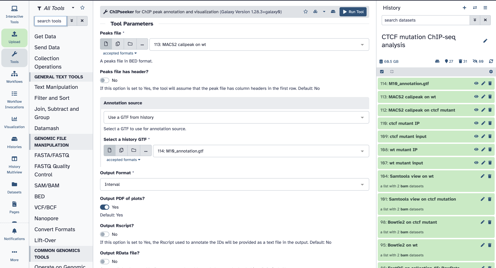

We will get 1 outputs for each run: the *Annotated Peaks* output and the *Plots* output. 
Name the outputs: 
- *ChIPseeker on wt: Annotated Peaks*
- *ChIPseeker on wt: Plots*
- *ChIPseeker on ctcf mutant: Annotated Peaks*
- *ChIPseeker on ctcf mutant: Plots*

From the annotated peaks output, we can see that the wt has 40,004 peaks and the CTCF mutant has 32,997 peaks (which can be seen from the number of lines of the output shown when you press *ChIPseeker on wt: Annotated Peaks*/ *ChIPseeker on ctcf mutant: Annotated Peaks* in the history). This already tells us that the CTCF mutant resulted in a reduction in CTCF binding in the lung tissue. This supports the idea that the mutation weakens CTCF’s ability to bind DNA or interact with cofactors. If peaks are lost at promoters, gene expression may decrease. If peaks are lost at enhancers, gene regulation may be disrupted. Also, CTCF helps form chromatin loops that regulate gene expression, thus losing around 7,000 peaks could disrupt TAD boundaries, leading to gene misregulation.

From the pdf output of *Plots*, we can see the distribution of the peaks in the genome. For example, ...........

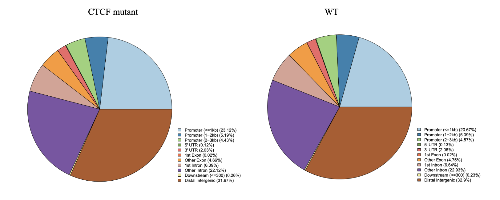

Create and upload list of genes for both wt and CTCF mutant
- Download the *Annotated Peaks* output of chIPseeker, delete the duplicate gene names, create a txt file with just the list of genes.
     - there are several ways to do this
          - If using macOS, open terminal and type
              ```
            tail +2 wt.tabular | cut -f 20 |  uniq > wt_geneId.txt
              ```
              where wt.tabular is the annotated peaks output from ChIPseeker for wt and wt_geneId.txt is the txt file that is going to be created containing unique gene names. Make sure wt.tabular is in the directory you are currently in.
       
          -  Another way is using excel. Open the file using a text editor, then copy and paste everything in the file into an excel sheet. We want the *geneName*, so copy the *geneName* column and copy and paste it into another sheet.

  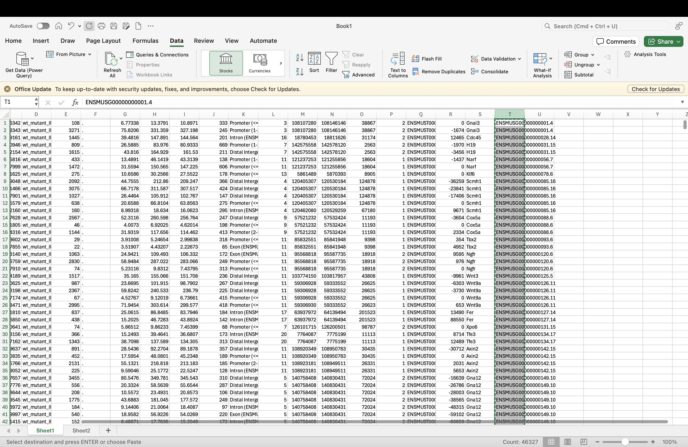

  
               -  To remove duplicates, highlight the whole column, click on the "Data" tab, then click on the remove duplicates button. Save this sheet as a txt file called wt_genes.
          


- Upload the 2 txt (*wt_geneId.txt* and *ctcf mutant_geneId.txt*) file to galaxy

### Step 8: Get the profile of the peaks 

First, run ```BamCoverage``` twice: Once on *Samtools view on wt* and once on *Samtools view on ctcf mutant*

```BAM coverage``` counts how many reads are at each spot in the genome. Instead of checking coverage at every single base, bamCoverage slices the genome into equal-sized bins — like 10 bp, 50 bp, or 100 bp — and counts how many reads fall into each bin. Thus, smaller bin size (e.g., 10 bp) results in higher resolution but is slower to compute and will reult is a larger file size. Meanwhile, a larger bin size results in a smother signal and smaller output but may miss small peaks or sharp features. 

Use the following settings:
- ```Bin size```: 10
- ```Scaling/Normalization method``` : Normalize to reads per kilobase per million
- ```Coverage file format``` : bigwig
-  ```Show advanced options``` : yes
     - ```Scale factors```
       - when running on *Samtools view on wt* = 1
       -when running on *Samtools view on ctcf mutant* = 0.70 (given in the paper)

Name the outputs: *bamCoverage on wt* and *bamCoverage on ctcf mutant*

Run ```Filter GTF data by attribute values_list``` for both wt_genes.txt and ctcf_mutant_genes.txt. This will filter the GTF annotation file to only include the genes that are assocaited with peaks in teh wt and CTCF mutant. 

Use the following settings:
-```Filter``` : M10_annotation.gtf
- ```Using attribute name```: gene_Id
- ```attribute values``` : *wt_geneId.txt*/ *ctcf_mutant_geneId.txt*

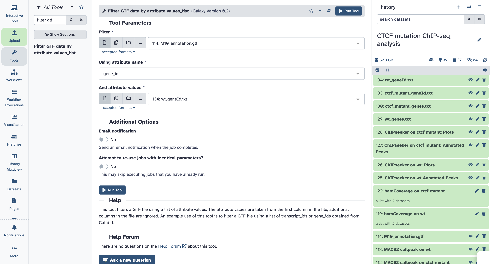


Name the outputs: *Filter GTF data by wt geneId* and *Filter GTF data by ctcf mutant geneId*

Run ```computeMatrix``` on *bamCoverage on wt* and *bamCoverage on ctcf mutant* in one run. ```computeMatrix``` prepares the data for vizualization by calculating the amount of signal (read coverage) there is around specific regions of the genome.

Use the following settings:
- ```Regions to plot``` : *Filter GTF data by wt geneId* 
- ```Score file``` : *bamCoverage on wt*, *bamCoverage on ctcf mutant* (as a dataset collection)
 
 - ```computeMatrix has two main output options``` : reference-point
      -  ```The reference point for the plotting ``` : beginning of region  //because we are interested in CTCF binding near gene promoter
      -  ```Distance upstream of the start site of the regions defined in the region file``` : 1000
      -  ```Distance downstream of the end site of the given regions```: 1000
-  ```Show advanced options ```: yes
     - ```Length, in bases, of non-overlapping bins used for averaging the score over the regions length```: 10
 
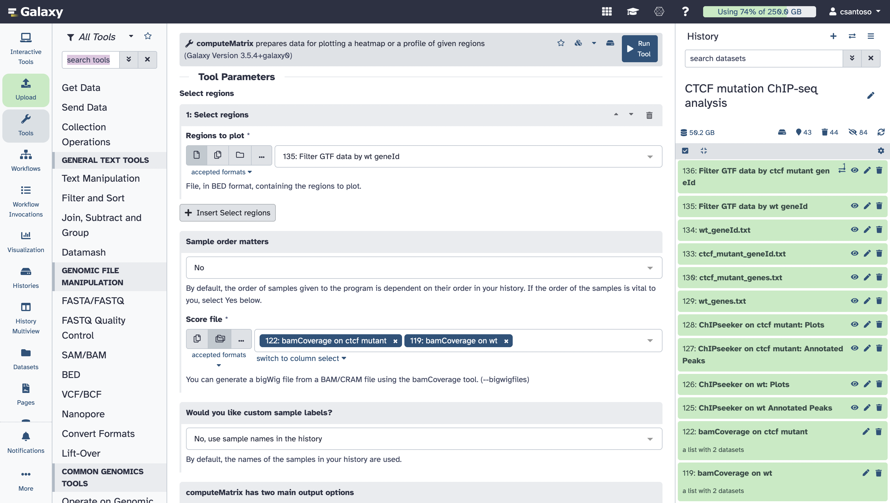


Name the output: *computeMatrix*

Run ```plotProfile``` on *computeMatrix*. ```plotProfile``` is used to create average signal plots (also called meta-plots) across a set of genomic regions.

Use the following settings:
- ```Matrix file from the computeMatrix tool``` : *computeMatrix*
- ```Show advanced options```: yes
     -  ```Labels for the samples (each bigwig) plotted```: "wt Input" "wt IP" "ctcf mutant Input" "ctcf mutant IP"
-  ```Title of the plot``` : CTCF ChIP-seq Binding Profile
-  ```Make one plot per group of regions``` : Yes

Name the output:  *plotProfile*. From the output, *wt IP* shows a strong, sharp peak at the region right before the TSS, indicating high binding affinity of CTCF at promoter regions.*ctcf mutant IP* shows a significant reduction in peak intensity, meaning less CTCF binding in the mutant at promoter regions. This suggests that the mutant form of CTCF loses its ability to bind strongly at transcription start sites, potentially disrupting gene regulation. Genes that rely on CTCF for proper transcriptional insulation or enhancer-promoter interactions might be misregulated, which could contribute to the dysregulated gene expression observed in mutant lungs mentioned in the [paper](https://www.nature.com/articles/s41467-024-49684-1).

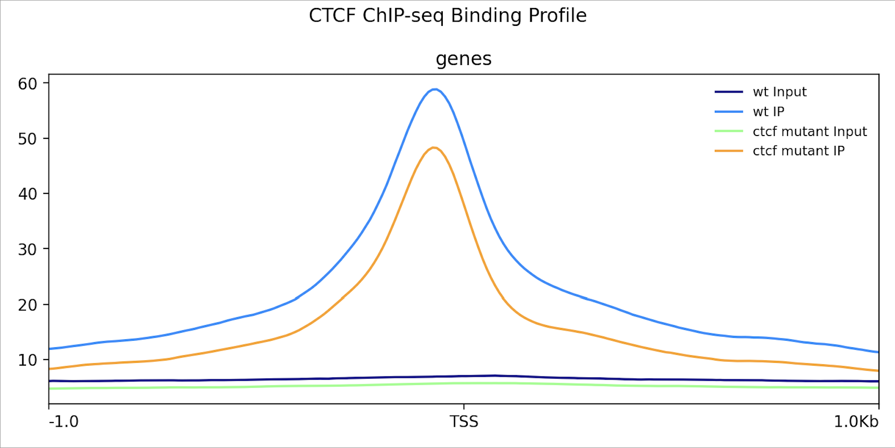

### Step 10: Peak visualization using ``IGV``` 
[Download Integretive Genome Viewer(IGV)](https://igv.org/doc/desktop/#DownloadPage/). This is what it looks like when you open the IGV application. 


Change the genome (top left corner) to Mouse (GRCm38/mm10). 


Fo example,  Irx1 and Irx2 play crucial roles in lung branching morphogenesis and are involved in signaling pathways that orchestrate mesenchymal differentiation
Their misregulation could lead to:
Excessive mesenchymal proliferation 
Malformed alveolar structures
Defective epithelial differentiation
Sheybani-Deloui et al 2022 showed that knocking out the Irx1 gene in mice led to gross histological defects in lung development


### Step 11: Motif analysis using ```memeChIP``` 

First run ```bedtools getfasta``` once on *MACS2 callpeak on wt* and once on *MACS2 callpeak on ctcf mutant*.

Use the following settings:
- ```BED/bedGraph/GFF/VCF/EncodePeak file``` : *MACS2 callpeak on wt*/*MACS2 callpeak on ctcf mutant*
- ```Choose the source for the FASTA file```: Server indexed files
     - ```fasta_id``` : Mouse (mus musculus): mm10

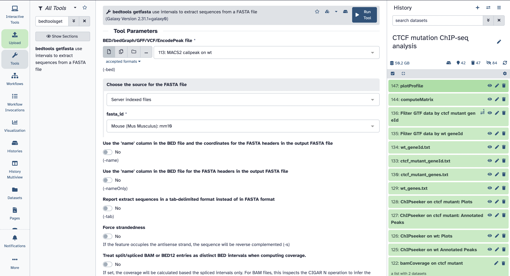

Name the outputs: *bedtools getfasta on ctcf mutant* and *bedtools getfasta on wt*

Run ```memeChIP``` . ```memeChIP``` analyzes sequences from ChIP-seq peaks and looks for common sequence patterns (motifs) that could represent binding sites.

Use the following settings:
- ```Primary sequences``` : *bedtools getfasta on ctcf mutant*/ *bedtools getfasta on wt*
- ```E-value threshold for including motifs```: 0.001
- ```What is the expected motif site distribution?``` : zero or one occurrences per sequence
- ```Maximum number of motifs to find``` : 20
- ```Stop DREME searching after reaching this E-value threshold``` : 0.001

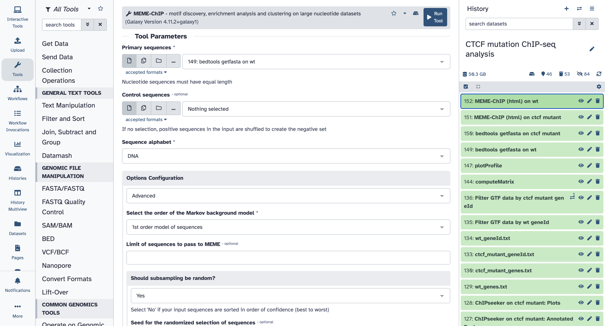

Interpretation of results: 
- The first meme motif in the wt resembles a known CTCF canonical motif. 
- The CTCF mutant has altered or shortened motifs.
     - for example, the 2nd meme motif for the CTCF mutant is a subset of the the 2nd meme motif for the wt
 - Though the 3rd meme motifd for both CTCF mutant and wt is similar which indicates that some motifs are still conserved
     - 

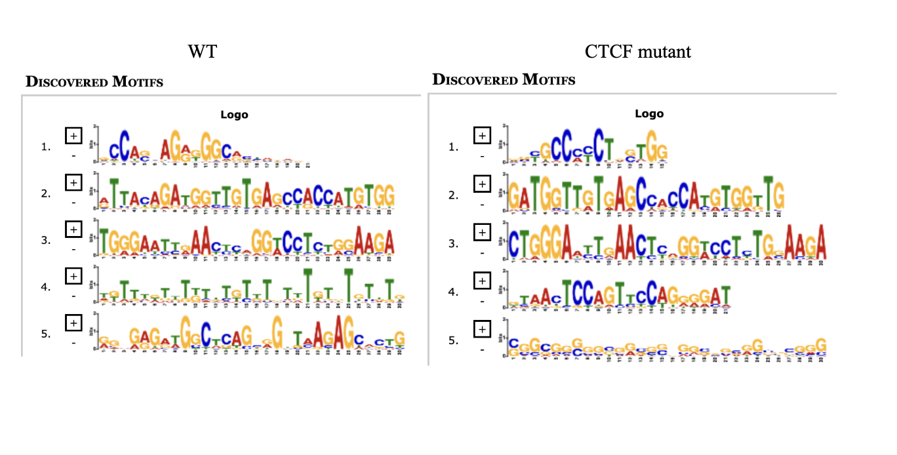


### Step 12: Gene Ontology  

Go to [ShinyGo](https://bioinformatics.sdstate.edu/go/). Change the species to mus musculus. Insert the list of genes in the box. 
Change the settings according to you preferences then press submit. 


